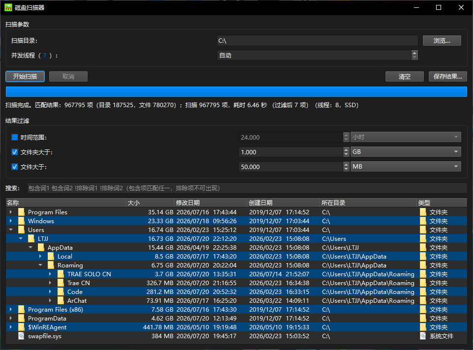

  

  <h1>Disk Scanner</h1>
  
扫描并显示指定路径下指定时间内创建或修改过、大小大于指定大小的文件或文件夹

   
    

   

  <h3>界面截图</h3>

  

---

## 功能
- 扫描并显示指定路径下指定时间内创建或修改过、大小大于指定大小的文件或文件夹
- 保存扫描结果到文件
- 也就是说如果你磁盘空间突然莫名暴跌，你可以用这个软件来找找这段时间新增了哪些文件给空间吃了。（这也是这款软件开发的初衷）

## 使用
### 要求
- Windows 系统

### 安装
- 下载最新 Release 里的 7z 压缩包，然后解压到你喜欢的位置
- **如果你想：** 给里面的 `Disk Scanner.exe` 添加快捷方式到桌面

### 卸载
- 直接删掉软件文件和快捷方式即可

---

# 开发相关
## 环境
- **构建工具**: QMake
- **Qt**: Qt 6.11.1
- **C++ 标准**: C++23

---

# 其他
## 许可证
本项目采用 MIT 许可证。详见 [LICENSE](LICENSE)。

## 致谢
- 感谢所有开源库和社区贡献者
